Graph Neural Networks (GNNs) are a type of machine learning model designed to work with graph-structured data. They help capture relationships between data points by learning from the connections between them.

**Why are GNNs important?** Many real-world systems are naturally structured as graphs. Examples include social networks, the internet, molecular structures, and more. Even data types like text, images, and tables can be converted into graphs to uncover complex relationships.

> In this article, we'll go through the basics of graph data structures and how machine learning models can be built on top of them. Here's the roadmap:

> - Introduction to the Planetoid dataset and problem definition

> - Overview of GNN architectures and key formulas

> - Building PyTorch models using custom Python classes

> - Training and evaluating the models

> - Final thoughts and takeaways


## Graph Datasets

Graph datasets represent data as nodes (entities) and edges (relationships). Each node and edge can have its own features or attributes.

We’ll use the Planetoid package from PyTorch Geometric to work with pre-built graph datasets, reducing the amount of setup required.

One commonly used dataset is Cora, a benchmark citation network. In Cora, each node represents a research paper, and edges represent citation links between papers. Each node has a feature vector based on the presence or absence of specific words in the paper (a total of 1433 possible words).

Cora is widely used to test GNN models on tasks like node classification and link prediction.

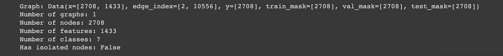

### Cora Dataset
- x = [2708, 1433]: This is the node feature matrix. There are 2708 documents, each represented by a 1433-dimensional one-hot encoded feature vector.

- edge_index = [2, 10556]: This defines the graph structure. It shows how nodes are connected, with each column representing a directed edge.

- y = [2708]: These are the ground-truth labels. Each node belongs to exactly one class.

- train_mask, val_mask, test_mask (each of shape [2708]): These masks are used to split the nodes into training, validation, and test sets.

> Let's pause for a moment to ponder. With a 1433-word feature vector, one could easily slap on a MLP model 👷 for some good old-fashioned node/document classification. But hey, we're not the ones to settle for the ordinary 🔎. We are going to cross the edge with edge_index to 🤾 dive headfirst with those relationships to supercharge our predictions. So let's get seriously interconnected up in here! 🤝


```
# Let us talk more about edge index/graph connectivity
print(f"Shape of graph connectivity: {cora[0].edge_index.shape}")
print(cora[0].edge_index)
```

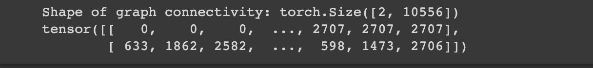

The edge_index is interesting as it contains two lists with the first list whispering the source node IDs, while the second spills the beans on their destinations. This setup has a fancy name: coordinate list (COO). It's a nifty way to efficiently store sparse matrices, like when you have nodes who aren't exactly chatty with everyone in the room.
Now, I know what you're thinking. Why not use a simple adjacency matrix? Well, in the realm of graph data, not every node is a social butterfly. Those adjacency matrices? They would be swimming in a sea of zeros, and that's not the most memory-efficient setup. That's why COO is our go-to approach 🧩 and PyG ensures the edges are inherently directed.

```
# The adjacency matrix can be inferred from the edge_index with a utility function.

adj_matrix = torch_geometric.utils.to_dense_adj(cora[0].edge_index)[0].numpy().astype(int)
print(f'Shape: {adj_matrix.shape}\nAdjacency matrix: \n{adj_matrix}')
```

```
# Some more PyG utility functions
print(f"Directed: {cora[0].is_directed()}")
print(f"Isolated Nodes: {cora[0].has_isolated_nodes()}")
print(f"Has Self Loops: {cora[0].has_self_loops()}")
```

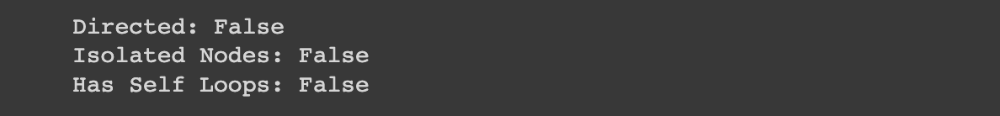

The Data object has many spectacular utility functions and let's give you a sneak peek with three examples:
- is_directed tells if the graph is directed, i.e., the adjacency matrix is not symmetric.
- has_isolated_edges sniffs out nodes that are loners, disconnected from the bustling crowd. These disconnected souls are like puzzle pieces without a complete picture, making downstream ML tasks a real head-scratcher.
- has_self_loops informs if a node is in a relationship with itself ❣


> Let's shortly talk about visualizations. Converting PyG Data objects into NetworkX graph objects and plotting them is a cake walk. But, hold your horses! Our guest list (number of nodes) is over 2k long, so an attempt to visualize it would be like squeezing a footballs stadium into your living room. Yeah, you don't want that ⛔. So, while we are not participating in the plot parties, just know that this graph is primed and ready for some serious networking action, even if it's all happening behind the scenes 🌐🕵️‍♀️


### CiteSeer Dataset

CiteSeer is the scholarly 🎓 sibling of Cora from the Platenoid family. It stands on the stage with 3,327 scientific papers with each node having exactly one of the 6 elite categories (class labels). Now, let's talk about data stats, where each paper/node in the CiteSeer universe is defined by a 3703-dimensional word vector with 0/1 values.

`citeseer = load_planetoid(name='CiteSeer')`


```
print(f"Directed: {citeseer[0].is_directed()}")
print(f"Isolated Nodes: {citeseer[0].has_isolated_nodes()}")
print(f"Has Self Loops: {citeseer[0].has_self_loops()}")
```
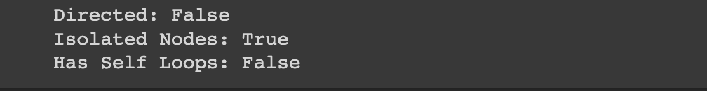


> With the citation network data duo that has already taken on the stage, we have got a slight twist in the scholarly saga. The CiteSeer dataset isn't all sunshine; it's got isolated nodes (remember our loners ❓). Now classiffication task is gonna be slightly difficult with these guys in the game.
Here's the catch: these isolated nodes pose a challenge to the GNNs aggregation (we will shortly talk about it) magic. We are limited to using only the feature vector representation for these isolated nodes, something that Multi-layer Perceptron (MLP) models do.
The absence of adjacency matrix information might take its toll with a drop in accuracy. While we can't do much to fix this problem, we will do our best to shed light on the effect of their no-connectivity 📚🔍.


```
# Node degree distribution

node_degrees = torch_geometric.utils.degree(citeseer.edge_index[0]).numpy()
node_degrees = Counter(node_degrees)  # convertt to a dictionary object

# Bar plot
fig, ax = plt.subplots(figsize=(18, 6))
ax.set_xlabel('Node degree')
ax.set_ylabel('Number of nodes')
ax.set_title('CiteSeer - Node Degree Distribution')
plt.bar(node_degrees.keys(),
        node_degrees.values(),
        color='#0A047A')
```

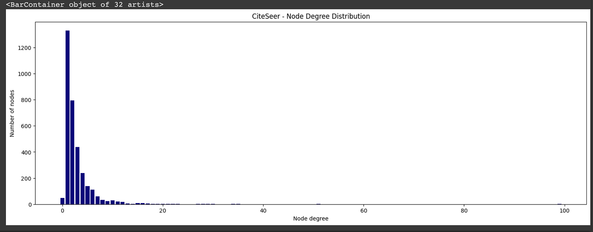

CiteSeer has a majority of nodes with 1 or 2 neighbors. Now you might be thinking, "What's the big deal?". Well, let me tell you, it would be like hosting a party with just a couple of friends - it is cozy, but there is no rave. The global information about their connections to the community is gonna be lacking. This could be another challenge for GNNs when compared with Cora.


## Problem Definition
Our mission is now crystal clear: armed with node feature representations of each node and their connections to their neighboring nodes, we are on a quest to predict the correct class label for each and every node in the given graph.

> Note: we are not only relying on the surface-level node feature matrix but are diving deep into the data fabric, analyzing every interaction, and deciphering every whisper. Its more about understanding the dataset than make simple raw predictions based on patterns.

### Unravelling Graph Neural Networks
We are about to demystify the magic behind GNNs. They represent nodes, edges, or graphs as numerical vectors such that each node resonates with its outgoing edges. But what's the secret sauce behind the GNNs? The technique of "message passing, aggregation, and update" operations. An analogy for this could be hosting a neighborhood block party, where each node aggregates information with its neighbors, transforms and updates itself, and then also share its updated insights with the rest of the crowd. It's about updating their feature vectors iteratively, infusing them with localized wisdom from their n-hop neighbors. Check out this gem: GNN Introduction which explains every concept with clarity.

GNNs are made up of layers, with each layer extending its hop to access information from neighbors. For example, a GNN with 2 layers a node would consider friend-of-firend distance to collect insights and update its representation.


## Basic GNN
We are creating a base class that lays the groundwork for our actual GNN models.We are also setting up private methods to initialize animation-related statistics. The base class will be inherited later by GCN and GAT models to tap into the shared functionalities without fuss. Effortless efficiency is right at your fingertips 🛠️📊🏗️.

```
class BaseGNN(torch.nn.Module):
    """
    Base class for Graph Neural Network models.
    """

    def __init__(
        self,
    ):
        super().__init__()
        torch.manual_seed(48)
        # Initialize lists to store animation-related statistics
        self._init_animate_stats()
        self.optimizer = None

    def _init_animate_stats(self) -> None:
        """Initialize animation-related statistics."""
        self.embeddings = []
        self.losses = []
        self.train_accuracies = []
        self.val_accuracies = []
        self.predictions = []

    def _update_animate_stats(
        self,
        embedding: torch.Tensor,
        loss: torch.Tensor,
        train_accuracy: float,
        val_accuracy: float,
        prediction: torch.Tensor,
    ) -> None:
        # Update animation-related statistics with new data
        self.embeddings.append(embedding)
        self.losses.append(loss)
        self.train_accuracies.append(train_accuracy)
        self.val_accuracies.append(val_accuracy)
        self.predictions.append(prediction)

    def accuracy(self, pred_y: torch.Tensor, y: torch.Tensor) -> float:
        """
        Calculate accuracy between predicted and true labels.

        :param pred (torch.Tensor): Predicted labels.
        :param y (torch.Tensor): True labels.

        :returns: Accuracy value.
        """
        return ((pred_y == y).sum() / len(y)).item()

    def fit(self, data: Data, epochs: int) -> None:
        """
        Train the GNN model on the provided data.

        :param data: The dataset to use for training.
        :param epochs: Number of training epochs.
        """
        # Use CrossEntropyLoss as the criterion for training
        criterion = torch.nn.CrossEntropyLoss()
        optimizer = self.optimizer

        self.train()
        for epoch in range(epochs + 1):
            # Training
            optimizer.zero_grad()
            _, out = self(data.x, data.edge_index)
            loss = criterion(out[data.train_mask], data.y[data.train_mask])
            acc = self.accuracy(
                out[data.train_mask].argmax(dim=1), data.y[data.train_mask]
            )
            loss.backward()
            optimizer.step()

            # Validation
            val_loss = criterion(out[data.val_mask], data.y[data.val_mask])
            val_acc = self.accuracy(
                out[data.val_mask].argmax(dim=1), data.y[data.val_mask]
            )
            kwargs = {
                "embedding": out.detach().cpu().numpy(),
                "loss": loss.detach().cpu().numpy(),
                "train_accuracy": acc,
                "val_accuracy": val_acc,
                "prediction": out.argmax(dim=1).detach().cpu().numpy(),
            }

            # Update animation-related statistics
            self._update_animate_stats(**kwargs)
            # Print metrics every 10 epochs
            if epoch % 25 == 0:
                print(
                    f"Epoch {epoch:>3} | Train Loss: {loss:.3f} | Train Acc: "
                    f"{acc * 100:>6.2f}% | Val Loss: {val_loss:.2f} | "
                    f"Val Acc: {val_acc * 100:.2f}%"
                )

    @torch.no_grad()
    def test(self, data: Data) -> float:
        """
        Evaluate the model on the test set and return the accuracy score.

        :param data: The dataset to use for testing.
        :return: Test accuracy.
        """
        # Set the model to evaluation mode
        self.eval()
        _, out = self(data.x, data.edge_index)
        acc = self.accuracy(
            out.argmax(dim=1)[data.test_mask], data.y[data.test_mask]
        )
        return acc
```

## Multi-Layer Perceptron Network
Here comes the vanilla Multi-layer Perceptron Network! In theory, we could predict a document/node's category just by looking at its features. No need for relational info - just the good old bag-of-words representation. To test the hypothesis, we define a simple 2-layer MLP that works solely with input node features.

## Graph Convolutional Networks
Convolutional Neural Networks (CNNs) have taken the ML scene by storm, thanks to their neat parameter-sharing trick and the ability to efficiently extract latent features. But aren't images also graphs? Confused! Let's think of each pixel as a node and the RGB values as node features. So a question emerges: can these CNN tricks be pulled off in the realm of irregular graphs?

It's not as simple as copy-pasting. Graphs have their own quirks:
* **Lack of Consistency**: Flexibility's great, but it brings some chaos. Just think of molecules with the same formula but different structures. Graphs can be tricky like that.
* **Node-Order Mystery**: Graphs have no fixed order, unlike texts or images. A node's like a guest at a party - no set place. Algorithms need to be chill 🕳 about this lack of node hierarchy.
* **Scaling Woes**: Graphs can grow BIG. Imagine social networks with billions of users and trillions of edges. Operating on that scale isn't a walk in the park.

```
class GCN(BaseGNN):
    """
    Graph Convolutional Network model for node classification.
    """

    def __init__(
        self, input_dim: int, hidden_dim: int, output_dim: int
    ):
        super().__init__()
        self.gcn1 = GCNConv(input_dim, hidden_dim)
        self.gcn2 = GCNConv(hidden_dim, output_dim)
        self.optimizer = torch.optim.Adam(
            self.parameters(), lr=0.01, weight_decay=5e-4
        )

    def forward(
        self, x: torch.Tensor, edge_index: torch.Tensor
    ) -> torch.Tensor:
        """
        Forward pass of the Graph Convolutional Network model.

        :param (torch.Tensor): Input feature tensor.
        :param (torch.Tensor): Graph connectivity information
        :returns torch.Tensor: Output tensor.
        """
        h = F.dropout(x, p=0.5, training=self.training)
        h = self.gcn1(h, edge_index).relu()
        h = F.dropout(h, p=0.5, training=self.training)
        h = self.gcn2(h, edge_index)

       return h, F.log_softmax(h, dim=1)
```

```
---

class GAT(BaseGNN):
    def __init__(self, input_dim: int, hidden_dim: int, output_dim: int,
                 heads: int=8):
        super().__init__()
        torch.manual_seed(48)
        self.gcn1 = GATConv(input_dim, hidden_dim, heads=heads)
        self.gcn2 = GATConv(hidden_dim * heads, output_dim, heads=1)
        self.optimizer = torch.optim.Adam(
            self.parameters(), lr=0.01, weight_decay=5e-4
        )

    def forward(
            self, x: torch.Tensor, edge_index: torch.Tensor
    ) -> torch.Tensor:
        """
        Forward pass of the Graph Convolutional Network model.

        :param (torch.Tensor): Input feature tensor.
        :param (torch.Tensor): Graph connectivity information
        :returns torch.Tensor: Output tensor.
        """
        h = F.dropout(x, p=0.6, training=self.training)
        h = self.gcn1(h, edge_index).relu()
        h = F.dropout(h, p=0.6, training=self.training)
        h = self.gcn2(h, edge_index).relu()
        return h, F.log_softmax(h, dim=1)
```

## Model Training
Let us see how the latent representations of the nodes in the graph evolve over time, as the model undergoes training for node classification tasks.

```
num_epochs = 200
def train_and_test_model(model, data: Data, num_epochs: int) -> tuple:
    """
    Train and test a given model on the provided data.

    :param model: The PyTorch model to train and test.
    :param data: The dataset to use for training and testing.
    :param num_epochs: Number of training epochs.
    :return: A tuple containing the trained model and the test accuracy.
    """
    model.fit(data, num_epochs)
    test_acc = model.test(data)
    return model, test_acc

mlp = MLP(
    input_dim=cora.num_features,
    hidden_dim=16,
    out_dim=cora.num_classes,
)
print(f"{mlp}\n", f"-"*88)
mlp, test_acc_mlp = train_and_test_model(mlp, data, num_epochs)
print(f"-"*88)
print(f"\nTest accuracy: {test_acc_mlp * 100:.2f}%\n")
```

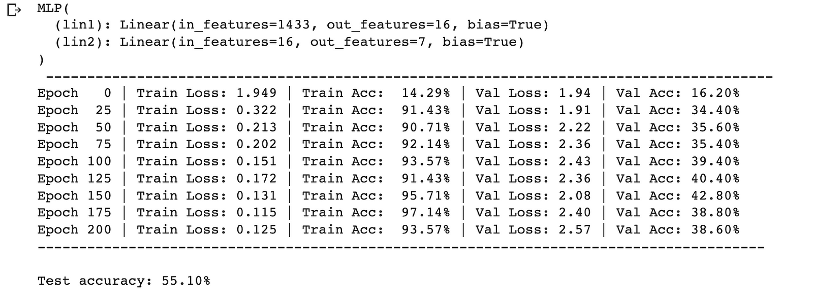

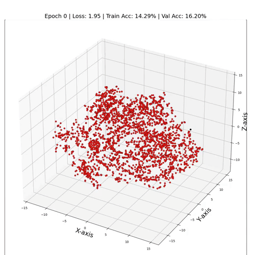

> As one can see, our MLP seems to be struggling in the spotlight, with just around 55% test accuracy. But why does the MLP do not perform better? The main culprit is none other than overfitting - the model's become too cozy with the training data, leaving it clueless when facing new node representations. Its like predicting labels with one eye closed. It also fails to incorporate an important bias into the model. That is exactly where GNNs come into play and can help to boost the performance of our model.


```
gcn = GCN(
    input_dim=cora.num_features,
    hidden_dim=16,
    output_dim=cora.num_classes,
)
print(f"{gcn}\n", f"-"*88)
gcn, test_acc_gcn = train_and_test_model(gcn, data, num_epochs)
print(f"-"*88)
print(f"\nTest accuracy: {test_acc_gcn * 100:.2f}%\n")
```

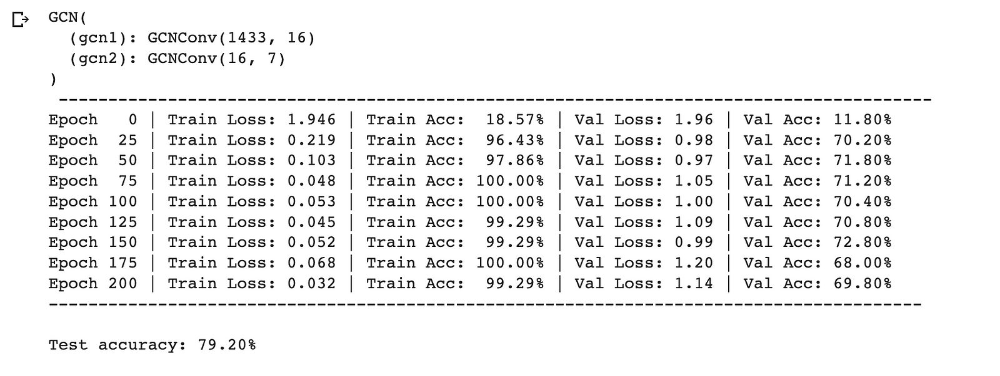
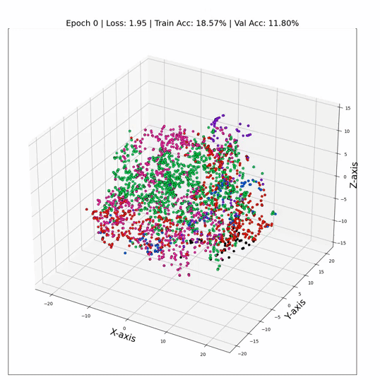

And there you have it - by just swapping out those linear layers GCN layers, we're skyrocketing to a dazzling 79% test accuracy!✨ A testament to the power of relational information between nodes. It's like we've turned on a data spotlight, revealing hidden patterns and connections that were previously lost in the shadows. The numbers don't lie - GNNs aren't just algorithms; they're data whisperers.

> Similarly, even GATs perform with a higher accuracy (81%) due to their multi-headed attention feature.


```
gat = GAT(
    input_dim=cora.num_features,
    hidden_dim=8,
    output_dim=cora.num_classes,
    heads=6,
)
print(f"{gat}\n", f"-"*88)
gat, test_acc_gat = train_and_test_model(gat, data, num_epochs)
print(f"-"*88)
print(f"\nTest accuracy: {test_acc_gat * 100:.2f}%\n")
```

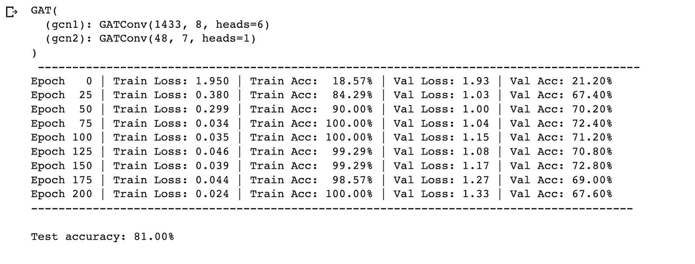
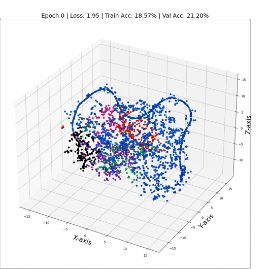

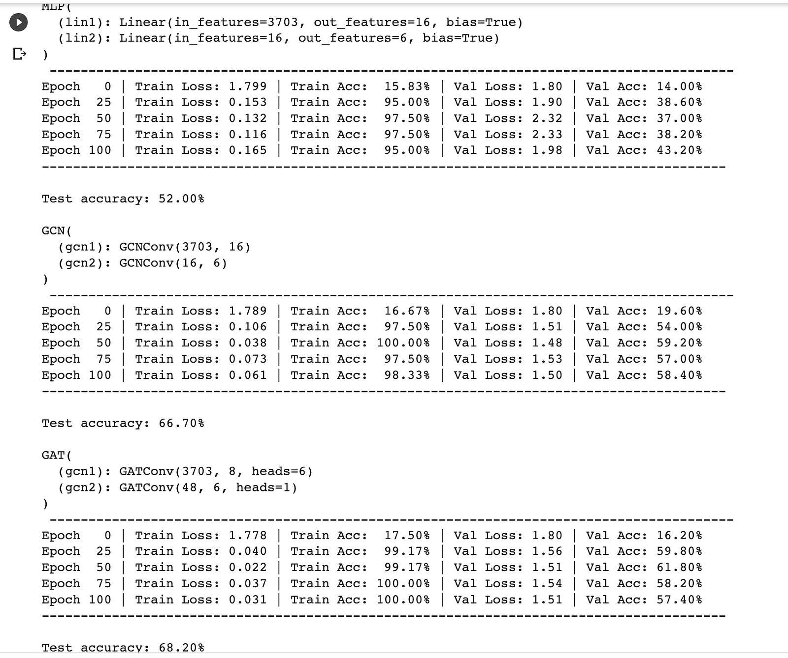

Let us look at the latent representation of our CiteSeer dataset using the TSNE dimensionality reduction technique. We use `matplotlib` and `seaborn` for plotting the nodes of the graph.

```
import matplotlib.pyplot as plt
from sklearn.manifold import TSNE
import seaborn as sns

# Get embeddings
embeddings, _ = gat(citeseer[0].x, citeseer[0].edge_index)

# Train TSNE
tsne = TSNE(n_components=2, learning_rate='auto',
            init='pca').fit_transform(embeddings.detach())

# Set the Seaborn theme
sns.set_theme(style="whitegrid")

# Plot TSNE
plt.figure(figsize=(10, 10))
plt.axis('off')
sns.scatterplot(x=tsne[:, 0], y=tsne[:, 1], hue=data.y, palette="viridis", s=50)
plt.legend([], [], frameon=False)
plt.show()
```

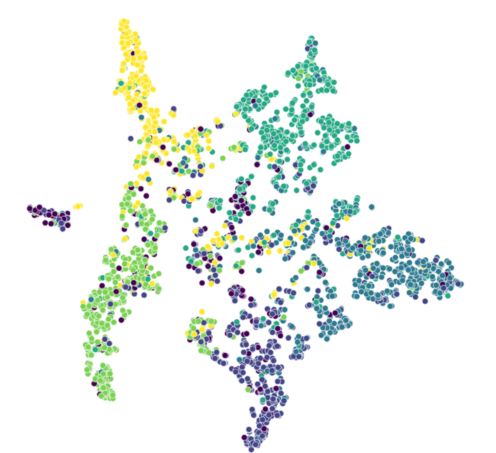

The data canvas paints a revealing picture: nodes of the same class gravitate towards each other forming clusters for each of the six class labels. However, outliers isolated nodes have a role in this drama, as they have introduced a twist to our accuracy scores.

> Remember our inital guess about the impact of mising edges? Well the hypothesis has its say. We are putting through another test, where I aim to calculate performance of GAT model by calculating the accuracy categorized by node degrees, thus revealing the importance of connectivity.

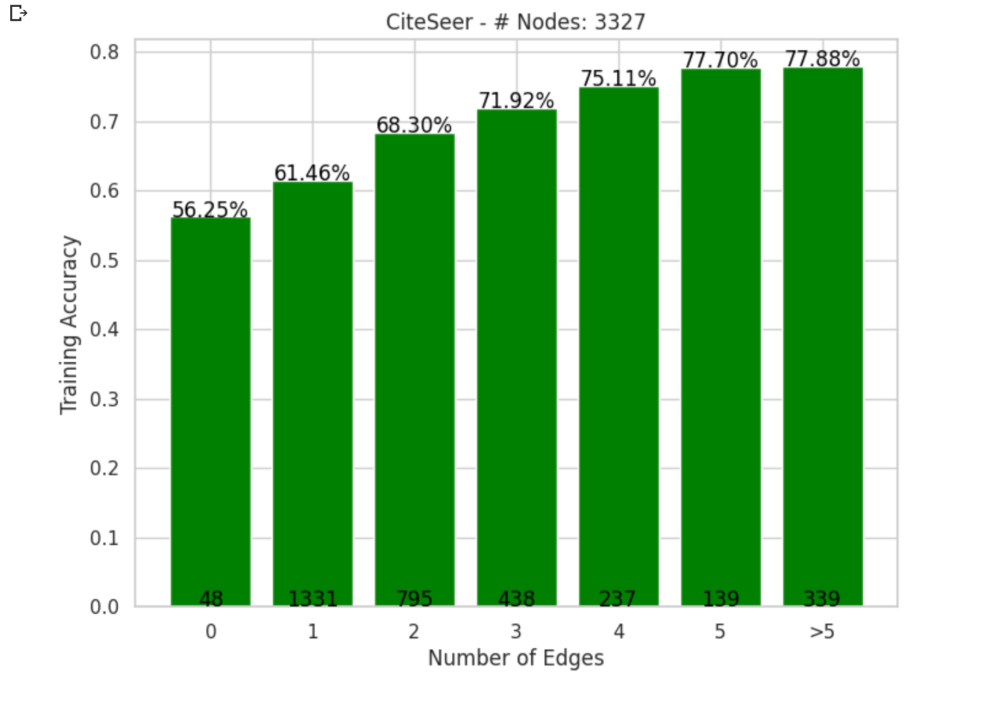

## Wrapping up
And with that, we reach the final section, I like to summarize the key takeaways:
1. We have seen why GNNs outshine MLPs and underscored the pivotal role of node relations.
2. GATs often outperform GCNs due to self-attention's dynamic weights, leading to better embeddings.
3. Be cautious with layer stacking; too many layers can lead to over-smoothing, where embeddings converge and lose diversity.