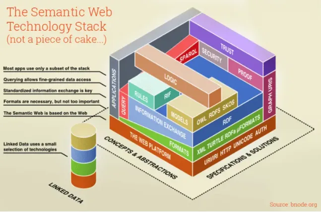
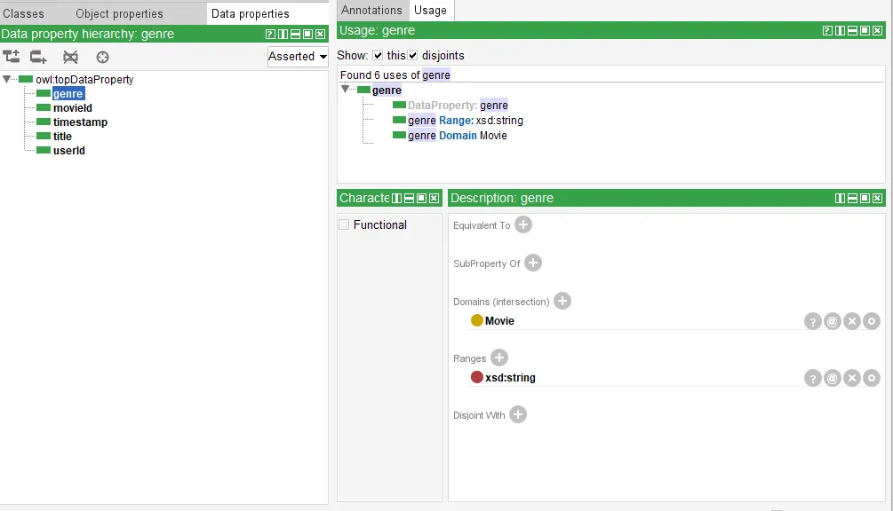
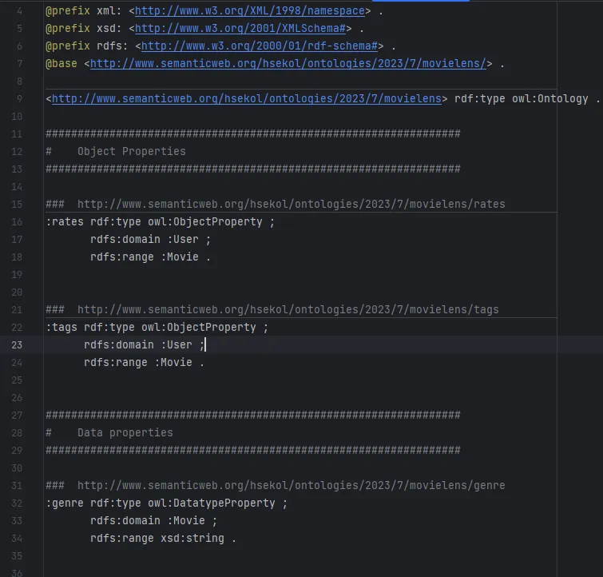
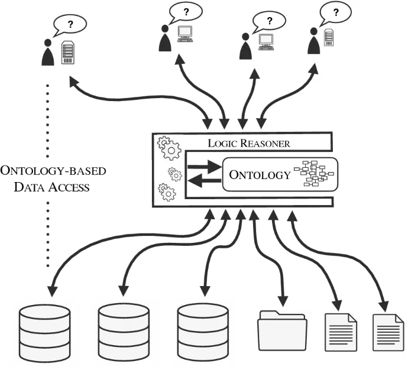

Confused by terms like “Knowledge Graphs,” “Graph Databases,” “Semantic Web,” or “Ontologies”? Don’t worry, this blog post is here to help! I get the overwhelm from these tech terms. Questions like “What are these?” “When to use them?” “Why do they matter?” and “How do ontologies link to knowledge graphs?” can be puzzling. But fear not! I’ll explain in simple terms, making it accessible to all. Let’s explore ontologies and their importance. Plus, I’ll show you how Python can automatically turn flat csv files into a knowledge graph using a set ontology — it’s like adding contacts to your phone. Exciting, right? 🚀📚🔍



We’ll use Protégé, a tool, to create a special structure — imagine it as a recipe for a MovieLens (EDA in my previous blog) dataset. Then, enter Python — we’re getting smart here. We’ll give the computer simple directions, so it can make a knowledge graph from this recipe. It’s like teaching a dog a trick, but Python is the clever one.

But hold on, what’s the reason behind all this effort? Imagine having a huge jigsaw puzzle, and your aim is to piece it together for the full picture. Crafting graphs from data is a bit like that — it helps us organize a ton of information during the data ingestion process. And ontologies? They provide structure and rules, making sure the graph makes perfect sense. Picture this: you’re tidying up a messy room — you put labels on different things like books, toys, and clothes. Ontologies do a similar job, but for data. They neatly categorize information and show how these categories are connected. 📌🌐

We aim to maximize automation in the data ingestion process when constructing knowledge graphs, particularly when dealing with extensive data and diverse organizational information. Manual tasks can be exhausting and error prone. Let’s promptly clarify some terms. This will establish a strong base, particularly for those new to this field. 👉

## Understanding Ontologies
In the context of the semantic web and knowledge graphs, an ontology serves as a formal description of concepts, connections, properties, and rules within a specific domain. These components are often visually represented using a graph model, where nodes symbolize concepts or classes, and connections illustrate the relationships between these nodes. For example, in the field of medicine, nodes could include ‘diseases,’ ‘symptoms,’ and ‘patients,’ while connections might portray relationships like ‘causes,’ ‘treats,’ and ‘diagnoses.’ Think of ontologies as intricate maps that systematically arranges complex real-world elements into a coherent guide that computers can understand.

To put it even simpler, ontologies transform the complexities of reality into a structured guide that helps computers understand and categorize knowledge about real-world objects in an abstract manner. To construct such a description, we meticulously define various components: individuals (object instances), classes, attributes, relations, as well as constraints, rules, and axioms governing them. This methodical approach not only offers a shared and reusable representation of knowledge but also has the potential to expand our domain understanding with new insights.

Let us construct a basic ontology onto for our MovieLens dataset employing Protégé.




We export the onto in a compact and human-readable Turtle format. The syntack of Turtle is widely used to represent RDF data and provides meaningful prefixes and is a convenient choice for exchanging semantic information.



> For users who prefer coding and want a more streamlined approach to ontology conversion, “Owlready2” offers a better fit. Its automation and targeted output formats align with a coding-centric workflow, making it a suitable choice for those who want to integrate ontology concepts efficiently into software projects without the complexities of a comprehensive tool like Protege. ✨


**Parsing the ontology in Python**
The RDFlib is a popular Python library with tools and utilities to create, manipulate, and query RDF data and ontologies. The below code snippet demonstrates to load and parse ontology stored in Turtle format.

```
def _parseOntology(path: str = None) -> rdflib.Graph():
    import rdflib
    # Instantiate a graph as defined in the rdflib library
    onto = rdflib.Graph()
    onto.parse(path, format='turtle')
    return onto
```

Next, we define two cypher queries to read the classes and their associated datatype properties and ranges. The queries are structured using RDF and OWL prefixes, selecting distinct classes and aggregating property-type pairs for each class using SPARQL. At last the result is grouped by class

```
# read the onto and generate cypher
classes_and_props_query = """
prefix owl: <http://www.w3.org/2002/07/owl#>
prefix rdf: <http://www.w3.org/1999/02/22-rdf-syntax-ns#>

SELECT DISTINCT ?class (GROUP_CONCAT(DISTINCT ?propTypePair ; SEPARATOR=",") AS ?props)
WHERE {
    ?class rdf:type owl:Class .
    optional {
      ?prop rdfs:domain ?class ;
        a owl:DatatypeProperty ;
        rdfs:range ?range .
      BIND (concat(str(?prop),';',str(?range)) AS ?propTypePair)
    }
  } GROUP BY ?class  """
```

The query selects distinct relationships, along with their domains and ranges. The resulting triples are filtered by property class types such as ObjectProperty and FunctionalProperty. The final query retrieves relationships, domains, and ranges for analysis or processing.

```
relations_query = """
prefix owl: <http://www.w3.org/2002/07/owl#>
prefix rdf: <http://www.w3.org/1999/02/22-rdf-syntax-ns#>

SELECT DISTINCT ?rel ?dom ?ran #(GROUP_CONCAT(DISTINCT ?relTriplet ; SEPARATOR=",") AS ?rels)
WHERE {
    ?rel a ?propertyClass .
    filter(?propertyClass in (rdf:Property, owl:ObjectProperty, owl:FunctionalProperty, owl:AsymmetricProperty,
           owl:InverseFunctionalProperty, owl:IrreflexiveProperty, owl:ReflexiveProperty, owl:SymmetricProperty, owl:TransitiveProperty))

    ?rel rdfs:domain ?dom ;
      rdfs:range ?ran .

    #BIND (concat(str(?rel),';',str(?dom),';',str(?range)) AS ?relTriplet)

  }"""
```

## The Significance of Ontologies
You might be wondering, why do we even need ontologies? Well, they bridge the gap between human and machine understanding, enabling meaningful interactions. Even more crucially, they design adaptable data structures, essential for capturing the complexities of our data-rich and IoT-driven world. Ontologies go beyond connecting humans and computers; they also unify organizations. Imagine everyone utilizing ontologies — data management becomes seamless, reducing complexities and fueling insights. These ontologies establish a universal language where rules prevent confusion, elucidate concepts, and facilitate automated processes and scalable data handling. In today’s interconnected world, efficient collaboration is essential for shaping a better future, wouldn’t you agree? 🤖

Key components of an ontology include: 📝👉

1. Classes/Concepts: The main characters — think of them as categories like “Patient,” “Doctor,” and “Disease.” They’re the building blocks that give our playset structure.
2. Individuals/Instances: Meet the specific players, like “Dr. Strange” — they’re the actual characters who make our story real. They fit into the Classes/Concepts we’ve set up.
3. Properties: These are like relationships between characters, showing how they’re linked. For instance, the “hasSymptom” property links “Disease” and “Symptom,” just like clues in a detective story.
4. Axioms and Constraints: These are like the rules of our world. Axioms are like detective’s notes — logical statements that unravel relationships. And constraints are like stage directions, guiding the characters’ actions.
5. Hierarchies and Taxonomies: Imagine arranging characters in a family tree — the big categories are like the elders, and the specific ones are like their kids. It’s like giving order to our cast.
6. Inference: This is where the magic happens — characters’ actions lead to conclusions. It’s like predicting a twist in the plot based on the clues we’ve uncovered.



Notable ontology languages encompass RDF, OWL, and SKOS. These languages empower various domains to establish standardized ontologies for exchanging and annotating domain-specific data. Experts within each domain primarily oversee ontology development, which can stem from sources such as schema.org, industry specifications, or even be created from the ground up.

> Do schemas and ontologies share the same definition? 🔍
> No, an ontology acts as an adaptable blueprint for mutual domain comprehension, while a schema is an inflexible blueprint for organizing data within a particular system. Ontologies permit flexible expansions, commonly in AI and knowledge management, while schemas guarantee data consistency in database systems. 🌟

## Crucial vocabularies come into play:
- RDF: short for Resource Description Framework, is the web’s data maestro, working behind the scenes in search engines, online shopping recommendations, and social media feeds. Wherever data needs to be understood and connected, RDF quietly operates. It forms the bedrock for modelling and exchanging web data, represented as triples — subject-predicate-object statements. Within an RDF, the triple elements could take the form of resources identified by unique resource identifiers (URIs, well-known as URLs), literals (akin to those in XML), or auxiliary blank spaces.
- OWL: short for Web Ontology Language, is a prominent tool for constructing web-based ontologies. It delves deeper than RDF by introducing constructs that define classes, properties, and relationships. This enables developers to move beyond hierarchies and incorporate complex relationships and rules, making OWL a potent asset for representing and sharing knowledge in the semantic web landscape.
- GraphDB redefines data storage by capturing nodes and relationships rather than conventional tables or documents. They excel over traditional SQL databases in handling intricate relationships without complex JOIN operations, and also surpass many NoSQL databases in providing intuitive and efficient querying of highly connected data. Neo4j, an open-source, ACID-compliant graph database, is a key player. It’s available as AuraDB’s managed service or self-hosted with Community or Enterprise Editions. 🚀
- GraphQL: Similar to how SQL assists in querying data from conventional databases, GraphQL plays a comparable role, but for databases organized uniquely using RDF. While it mirrors SQL’s functionality, GraphQL’s focus lies in connecting diverse data fragments, rather than traditional rows and columns. If you’re well-versed in SQL querying, envision GraphQL as the tailored tool for a distinct data structure. Notably, options include SPARQL for most graph databases, Cypher for Neo4j, Gremlin under the Apache TinkerPop framework, and more. Your choice of graph database and query language hinges on your project’s specifics and the underlying data model.

In this part, we covered ontologies, knowledge graphs, and graph models, exploring their relationships and dependencies. We discussed ontologies’ role in building scalable, diverse data graphs between organizations. We created an ontology in Protege and parsed it with Cypher queries. We also explored additional terminology. The blog part — 2 will demonstrate how our ontology generates a knowledge graph from CSV files automatically, offering a practical illustration. 🌟