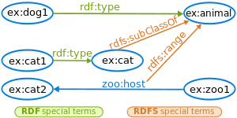
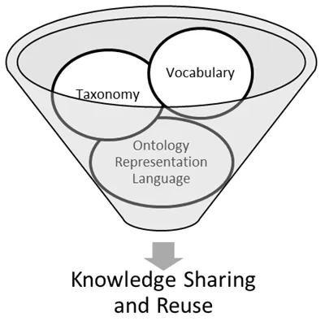
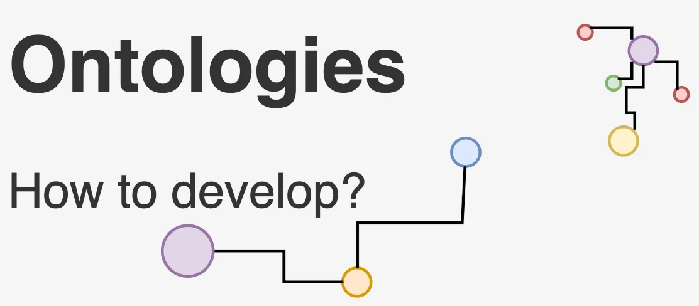
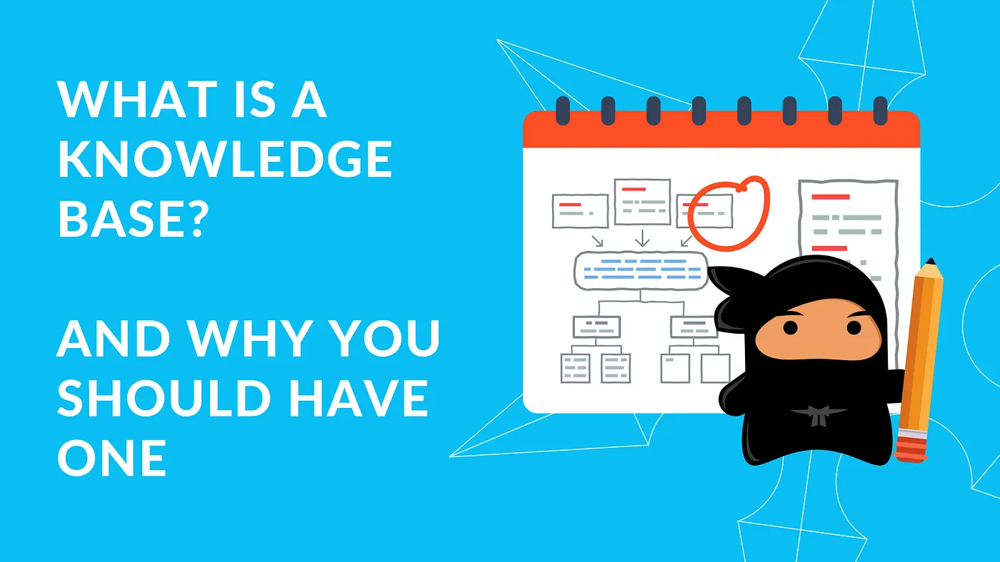

Welcome to the world of Semantic Web! 🌐 It's a broad term where ideas and technologies come together to tackle the overwhelming amount of information scattered across the internet. The goal?
Standardising information stored in disparate data silos
Making data structured and interoperable to allow inferencing
Up-float knowledge that is not explicitly stated, even for machines.


The overwhelming amount of information scattered across the internetIf you believe in above goals or been overwhelmed by different terminologies, this article will simplify the chaotic landscape of the Semantic Web. Here is what you can expect:
- Introduction - The need for Semantic Web
- Understanding Resource Description Frameworks (RDF)
- Why do we care about RDFS and Shared Vocabularies
- Knowledge Representation as Ontologies

But first, let's talk about the everyday struggles we face in the non-semantic (HTML-based or similar) web world.

## The Search Struggle: Misinformation, Social Media Flood, and Generative AI Mayhem

Sure, search engines are lightning-fast ⚡, but are they always spot-on? 🎯 Nope! We still end up sifting through a mountain of irrelevant search results just to find what we're looking for, the misinformation maze and the unstoppable flood 🌊 of social media content. Adding to the chaos, we've got Generative AI bots churning out content faster than we can say 'Semantic Web'! 😅 These challenges not only diminish the quality of information but also consume precious time. The need for the Semantic Web is evident in addressing these challenges.

So, how does it work its magic? Well, picture this: every concept and the relationship between these concepts on the web gets its own special ID badge called a Universal Resource Identifier (a string of characters uniquely identifies any resource, where a "resource" can be anything from a "thing" to a "concept"). We have already known them for some time with our web page URLs, but let's not get confused here. So far these URLs were pointing at documents 🎟️ (the HTML web pages), what I am talking about is URIs pointing to each atomic concept present within a single document (a HTML web page).

As you can guess just with URI we are able to loosen much of the ambiguity in the information. But wait, there's more! Semantic Web takes a step further by asking these concepts to hang out in fancy hierarchies of classificationscalled ontologies 👪. Now we can search smarter with our required classified keywords of concepts and relationships, thanks to these URIs and ontologies. It's like having a super-smart librarian who knows exactly where to find what you're looking for. 📚 Let us continue by looking at some key components in this realm

---

## Resource Description Framework (RDF)
We have all seen how Generative AI goes off the rails when creating contentthe hallucinations is due to its lack of ability to truly grasp the context/meaning behind the information it is processing. And this not only affects the accuracy of search results but also hinders our progress toward a more semantic web. To bridge this gap, we need two things:
1. A way to uniquely identify every concept
2. A universal system for conveying and interpreting their meaning

But, as with any great endeavour, there are hurdles to overcome. One such challenge is achieving consensus on the definitions of these concepts and ensuring seamless data sharing. Sounds daunting, right? So, what's the plan? Well, let's kick things off by making data interoperable within organisations. Think of like laying the foundation for a grand data-sharing party, complete with invitations, guest lists, and maybe even some fancy dance moves (data governance, policies, access controlyou name it! 💃🕺).

> One strategy in traction is the concept of "meta-tagging" resources. It's like adding little sticky notes to our data, providing additional context in the form of properties and values. For example, we could tag "Harper Lee" as the author of "To Kill a Mockingbird" and throw in some extra info like gender (let's say female, just for kicks).

With this base the World Wide Web Consortium developed Resource Description Framework (RDF) for automated semantic processing of information. The RDF structures information into neat little statements called triples, each consisting of a subject, predicate, and object 📊. One can think of it as a data-model for humans and a language for machines to speakone where they can declare how concepts are connected to each other and what property values they have. Now, let's talk about these tripleseach triple is made up of three atomic elements, represented by URIs and could be one of the following:
- a link to a resource
- a link to a property definition
- a literal value (like "33")
- a blank node (a mysterious placeholder)

And there are two popular models for organising triples: 
- the classic subject-predicate-object and 
- the more casual entity-attribute-value

- To illustrate, let's revisit our buddy Harper Lee and her age-defying literary masterpiece. We can express the fact that "The book `To Kill a Mockingbird` was written by Harper Lee, who was born in 1926" in a machine-readable format (RDF).

```
Triple 1 <Subject-Predicate-Object >:
Subject: The book 'To Kill a Mockingbird'
Predicate: writtenBy
Object: Harper Lee

Triple 2 <entity-attribute-value>:
Subject: Harper Lee
Predicate: born
Object: 1926

# To express these statements in RDF triples:
Triple 1:
Subject (URI): http://example.com/books/to-kill-a-mockingbird
Predicate (URI): http://example.com/properties/written-by
Object (URI): http://example.com/authors/harper-lee

Triple 2:
Subject (URI): http://example.com/authors/harper-lee
Predicate (URI): http://example.com/properties/born
Object (literal): 1926
```

Let's define a namespace `ex` for the base URI `http://example.com/` for readability and let's use the Turtle format representation to express the same RDF information.

```
@prefix ex: <http://example.com/>.
ex:books/to-kill-a-mockingbird ex:properties/written-by ex:authors/harper-lee .
ex:authors/harper-lee ex:properties/born 1926 .
```

It's like giving our data a passport for the semantic webneat, organized, and ready for adventure. Great! but isn't this too tedious? Restructuring each piece of information into triples and then figuring out how to leverage them to address our scalability concerns!🧐

Let's bring Named Graphs into our discussion 🤓a set of triples named by identified by a unique name or identifier (URI). This URI can later be used outside or with the scope of the graph to refer to it

Named Graphs lets us compartmentalise RDF data into distinct, named contexts or graphs, kind of like putting them into labeled folders. This makes data management a breeze, allowing us to scale up, track versions, enforce security, and even throw in some provenance tracking for good measure. So, there you have itthe journey from chaotic data to organized knowledge, guided by RDF, triples, and named graphs 🌟

---

## RDF Schema (RDFS)
Ah, so we've got RDF, our trusty model for representing data with our own vocabularies. But wait, there's more! While RDF lays down the groundwork, it doesn't quite cover all the bases when it comes to expressing the nitty-gritty of complex relationships and constraints in our data. RDF doesn't play favorites with any particular application domain or set the semantics for how things should be understood within a domain. Nope, that's left entirely up to us, and this is where RDF Schema (RDFS) comes into play.



RDF Schema: A Vocabulary Description LanguageRDFS extends RDF's capabilities, acting as a vocabulary description language for describing properties and classes with flair. While, RDF provides a basic framework for representing data, RDFS enhances it with additional features for defining schemas, specifying constraints, and enabling multi-hop inferencing → leading to semantically richer data models. The resources in the RDFS vocabulary also have URIs with the prefix :

`@prefix rdfs: http://www.w3.org/2000/01/rdf-schema#`

RDF Schema is a primitive ontology language that offers certain modelling advantages like:
1. Hierarchical Structure: Creation of relationships between `classes` and `sub-classes` which enhances the expressiveness of RDF by allowing for more complex classification and inferencing
2. Domain and Range Constraints: enables specifications for properties and restrictions on the allowed types of resources that can be linked to a specific property. This helps in ensuring data consistency and validity.
3. Property Inheritance: Properties defined within a class are automatically inherited by its sub-classes. This reduces redundancy and simplifies the ontology by allowing the reuse of existing properties.
4. Inference and Reasoning: enables automated reasoning engines to derive additional information from existing data within the domain -specific constraints


Now, let's dive into the RDFS vocabulary and its key components:
1. Classes: A class can be thought of as a container of related items, with each item inside the container referred to as an instance of that class. If it helps, you can think of a class as a broad category or type, similar to how objects are grouped in object-oriented programming languages. RDFS classes can represent a wide range of things, such as web pages, people, documents, databases, or abstract ideas. These classes are defined using special terms provided by RDF Schema, like rdfs:Class and rdfs:Resource, and are linked using properties like rdf:type and rdfs:subClassOf. The connection between instances and classes is established using the rdf:type property.
2. Properties: Besides classes, properties are essential for adding characteristics to these classes of entities. For instance, think of 'numberOfPages' in a Book class. In RDFS, properties are defined using the RDF class rdf:Property and associated with RDFS properties such as rdfs:domain, rdfs:range, and rdfs:subPropertyOf

> Keep in mind: Just as in programming languages, typing is employed to ensure proper usage of objects within a class. In RDF documents, the use of classes places constraints on which objects properties can be assigned to, establishing permissible domains or ranges for specific properties.

Now, let's simplify all this with a little example:

The `rdfs:range` property tells us which class the values of a specific property belong to. For instance, if we want to say that the ex:author property's values are instances of the ex:Person class, we use these RDF statements:

```
ex:Person rdf:type rdfs:Class .
ex:author rdf:type rdf:Property .
ex:author rdfs:range ex:Person .
```

These statements clarify that `ex:Person` represents a class, ex:author is a property, and any RDF statements involving the ex:author property will have instances of ex:Person as their values.
On the other hand, the rdfs:domain property indicates which class the property is associated with. For example, if we want to specify that the ex:author property pertains to instances of the ex:Book class, we use these RDF statements:

```
ex:Book rdf:type rdfs:Class .
ex:author rdf:type rdf:Property .
ex:author rdfs:domain ex:Book .
```

These statements clarify that ex:Book represents a class, ex:author is a property, and any RDF statements involving the ex:author property will have instances of ex:Book as their subjects.
## Shared vocabularies
RDFS enables the creation of custom vocabularies, but isn't it wise to laverage an existing vocabulary crafted by others who believes in the potential of semantic web and are defining vocabularies a similar conceptual domain? These publicly accessible vocabularies, known as shared vocabularies not only prove cost-effective by also promote the shared comprehension of the described domains.


The notion of shared vocabularies is pivotal in realizing the Semantic Web's objectives, as it allows different data sources to communicate effectively with each other and to be integrated into a unified knowledge graph. By employing shared vocabularies, developers and organizations can ensure the easy comprehension, interpretation and fusion of their datawith that from other sources.

Examples include:
1. Dublin Core Metadata Initiative (DCMI): Offers standardized metadata terms for describing resources like documents, images, and web pages, covering crucial attributes such as title, author, date, and subject, enhancing resource discovery and management on the web.
2. Friend of a Friend (FOAF): A vocabulary for portraying people and their relationships in machine-readable format, with terms for personal profiles, social networks, and connections, enabling seamless exchange of user and social network data across applications.
3. Schema.org: A collaborative venture by major search engines to establish a shared vocabulary for describing structured web data, with terms encompassing events, products, organizations, and creative works, ensuring easy comprehension by search engines and applications.
4. Geospatial Vocabularies: Various vocabularies like GeoNames ontology, Simple Features Vocabulary, and GeoSPARQL vocabulary for geospatial data representation, defining terms for geographical features, coordinates, and spatial relationships, fostering interoperability across systems.
5. SKOS (Simple Knowledge Organization System): A vocabulary for representing knowledge organization systems like taxonomies and thesauri, offering terms for concepts, labels, and relationships, facilitating structured knowledge resource management and exchange.


---

## Knowledge Representation as Ontologies
In the field of artificial intelligence (AI), Knowledge Representation serves as a common modelling approach, utilising mathematical logics such as first-order logic. Ontologies are a specific framework within this paradigm, incorporating logical formalisms like OWL (Web Ontology Language) to structure and organize information. They formally describe a domain of related concepts and their relationships.



Ontologies can encompass the concepts and structures we saw in RDF, RDFS, and shared vocabularies, but they often go beyond them by including additional elements such as axioms, rules, and logical expressions to capture more complex knowledge structures and facilitate reasoning. They are important because they serve as semantic schemata (or 'intelligent' views over information resources) for automated reasoning about the data. An ontology O can be formally represented as a quadruple:
O = <C, R, I, A>, where:

> - C: a set of classes representing concepts within the domain under consideration. For example, "Author," "Book," "Genre," and "Publisher."
- R: a set of relations, also known as properties or predicates, establishing connections between instances of classes. For example, the relation "Author wrote Book" indicates the association between an author and a book.
- I: a set of instances, each of which may belong to one or more classes and may be linked to other instances or literal values through relations. For example, an instance might be "Harper Lee," belonging to the class "Author," and linked to the instance "To Kill a Mockingbird" via the "wrote" relation.
- A: a set of axioms, which define logical rules or constraints within the ontology. For example, an axiom might specify that if an author was born before 1930, they are considered a pre-World War II author.


In this configuration, the ontology facilitates the structured representation of knowledge within the domain, enabling precise modeling of relationships between entities such as authors and books and supporting reasoning over the data. If we are to classify ontologies:

1. Light-weight vs. Heavy-weight Ontologies:
Light-weight: These ontologies are simpler and more scalable, suitable for efficient reasoning. Example: FOAF (Friend of a Friend) ontology.
2. Heavy-weight: These ontologies are more complex and offer higher predictive power but may require more computational resources. Example: SUMO (Suggested Upper Merged Ontology).
3. Upper-level, Domain, and Application Ontologies: Upper-level: Provide general knowledge applicable across various domains. Example: Cyc.
      Domain: Focus on specific subject areas like healthcare or finance. Example: SNOMED CT (Systematized Nomenclature of MedicineClinical Terms).
      Application: Tailored to specific software applications or industries. Example: MusicBrainz ontology.
      3Schema-ontologies:
      Describe classes of objects, properties, and relationships similar to database schemas. Example: Dublin Core Metadata Element Set.
4. Topic-ontologies:
   Define hierarchies of topics or subjects for classification purposes. Example: Library of Congress Subject Headings (LCSH).
5. Lexical Ontologies: Provide formal semantics for lexical concepts, like word meanings and relationships. Example: WordNet.




Now, let's introduce one final term in this article: Knowledge Bases. While ontologies define the structure and semantics of knowledge, Knowledge Bases store and manage the actual instances of that knowledge. Picture ontologies as the blueprint or schema for organising knowledge, while knowledge bases act as the repositories where the actual data resides.

Here are some examples of knowledge bases:

1. Wikidata: A free and open knowledge base containing data on a wide array of topics, including people, places, organizations, events, and concepts. 🌐
2. DBpedia: A knowledge base that extracts structured information from Wikipedia and presents it as Linked Data. 🔗
3. Freebase (No Longer Active): A collaborative knowledge base and data repository acquired by Google in 2010. 🕰️
4. YAGO (Yet Another Great Ontology): A large knowledge base that amalgamates information from Wikipedia, WordNet, and other sources. 📚
5. Google Knowledge Graph: A knowledge base employed by Google to enrich search results and furnish users with pertinent information. 🔍

> That concludes our discussion for today. I trust this article provided you with a comprehensive introduction to the evolution of the semantic web, its significance, and the key components essential to embark on your semantic journey. There's a wealth of resources available, so feel free to share more in the comments section to foster the linking of information via common entities. ✨